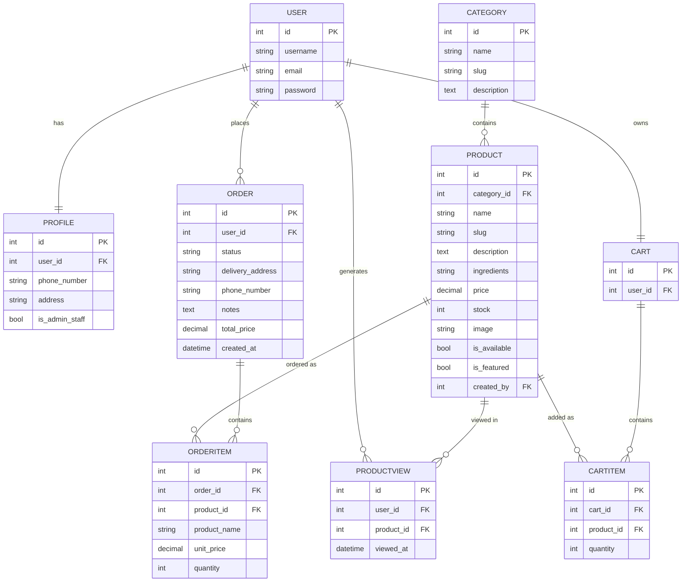

# ER Diagram - Sweet Crumb Bakery E-Commerce System

A rendered image is available at `docs/ER_diagram.png`. The Mermaid source
below is provided as an editable, text-based alternative (renders on GitHub
and most Markdown viewers that support Mermaid).

